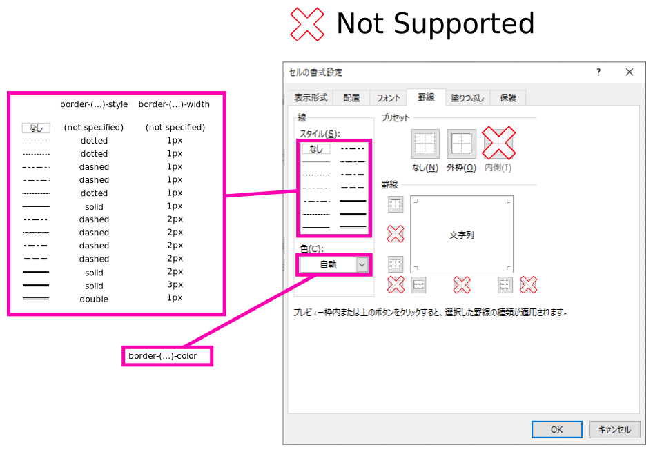

## Wish

### 文字列の align

 - 左右の align を `text-align:` に反映する

| Excel側指定値 |  対応値  |
| :-----------: | :------: |
|   指定なし    |  `left`  |
|  `中央揃え`   | `center` |
|   `右揃え`    | `right`  |

 - 上下 align を `vertical-align:` に反映

| Excel側指定値  |  対応値  |
| :------------: | :------: |
|    指定なし    | 指定なし |
| `上下中央揃え` | `middle` |
|    `下揃え`    | `bottom` |

### border

  

 - border-top-style
 - border-top-color
 - border-top-width
 - border-right-style
 - border-right-color
 - border-right-width
 - border-bottom-style
 - border-bottom-color
 - border-bottom-width
 - border-left-style
 - border-left-color
 - border-left-width

